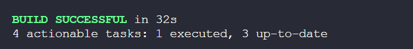

# Projeto de Automação - Site Renner

<div align="left">


</div>
 
###
 
# Descrição do Projeto
 
Este projeto tem como objetivo colocar em prática os meus conhecimentos adquiridos em automação de testes utilizando Selenium com Java e Gradle. Para isso, realizei diversos testes automatizados no site da Renner. Esses testes foram desenvolvidos com o intuito de explorar e validar diferentes funcionalidades do site, porém com o foco **em devolução de Pedidos**, aplicando os conceitos fundamentais de automação.
 
## Objetivos
 
- Praticar a automação de testes com Selenium
- Validar funcionalidades do site da Renner
- Validando funcionalidades na seção de devolução de pedido
- Implementar boas práticas de desenvolvimento de testes automatizados
 
## Tecnologias Utilizadas
 
- Java
- Selenium WebDriver
- Gradle
- JUnit
 
## Quantidades de Testes

Atualmente tem no total 4 testes, sendo atualizando diariamente.

<div align="left">


</div>

## Como Executar os Testes

1. Clone o repositório:

   ```sh
   git clone https://github.com/ChaiCaroline/Projeto-Automacao-Renner
   ```

2. Navegue até o diretório do projeto:

   ```sh
   cd Projeto-Automacao-Renner
   ```

3. Execute os testes usando Gradle:
   ```sh
   ./gradlew test
   ```

## Estrutura do Projeto

- `src/test/java`: Contém os testes automatizados
- `src/main/resources`: Contém arquivos de configuração e dados de teste

Este projeto é um passo importante na minha jornada de aprendizado em automação de testes.

## Referência

- [Documentação Selenium Boas Práticas.](https://www.selenium.dev/pt-br/documentation/test_practices/design_strategies/)
- [Trilha de Estudo - Alura](https://cursos.alura.com.br/meu-plano-de-estudos-chaiene-rocha-1712705751690-p753183)

## Autores

- [@Chaiene Caroline](https://github.com/ChaiCaroline)
