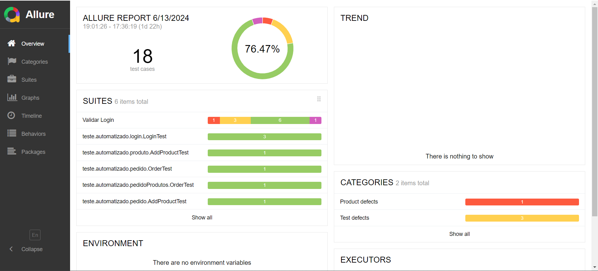
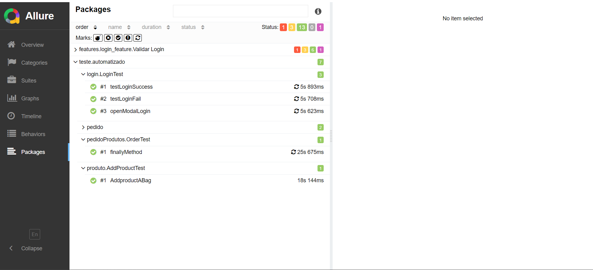

# Projeto de Automação - Site Renner

[](https://skillicons.dev)

###

# Descrição do Projeto

Este projeto tem como objetivo colocar em prática os meus conhecimentos adquiridos em automação de testes utilizando Selenium com Java e Gradle. Para isso, realizei diversos testes automatizados no site da Renner. Esses testes foram desenvolvidos com o intuito de explorar e validar diferentes funcionalidades do site, porém com o foco **em devolução de Pedidos**, aplicando os conceitos fundamentais de automação.

## Objetivos

- Praticar a automação de testes com Selenium
- Validar funcionalidades do site da Renner
- Validando funcionalidades na seção de devolução de pedido
- Implementar boas práticas de desenvolvimento de testes automatizados

## Tecnologias Utilizadas

- Java
- Selenium WebDriver
- Gradle
- JUnit
- Cucumber
- Allure Report

## Quantidades de Testes

Atualmente o projeto está com no total 9 testes.

- Teste em Login do usuário;
- Adicionar produto ao carrinho;
- Finalizar uma compra;

<div align="center">



</div>

## Como Executar os Testes

1. Clone o repositório:

   ```sh
   git clone https://github.com/ChaiCaroline/Projeto-Automacao-Renner
   ```

2. Navegue até o diretório do projeto:

   ```sh
   cd Projeto-Automacao-Renner
   ```

3. Execute os testes usando Gradle:

   ```sh
   ./gradlew test
   ```

4. Para criar a pasta do Allure Report

   ```sh
   ./gradlew allureReport
   ```

5. Para gerar a página com os testes do Allure Report
   ```sh
   ./gradlew allureServe
   ```

## Estrutura do Projeto

- `src/test/java/teste/automatizado`: Contém os testes automatizados
- `src/test/java/teste/acceptance/steps`: Contém os BDD's dos testes automatizados
- `src/main/resources`: Contém arquivos de configuração e dados de teste
- `src/main/resources/features`: Contém os cenarios e os BDD's dos testes.

Este projeto é um passo importante na minha jornada de aprendizado em automação de testes.

## Referência

- [Documentação Selenium Boas Práticas.](https://www.selenium.dev/pt-br/documentation/test_practices/design_strategies/)
- [Trilha de Estudo - Alura](https://cursos.alura.com.br/meu-plano-de-estudos-chaiene-rocha-1712705751690-p753183)

## Autores

- [@Chaiene Caroline](https://github.com/ChaiCaroline)
